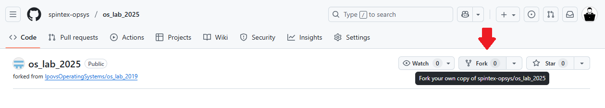
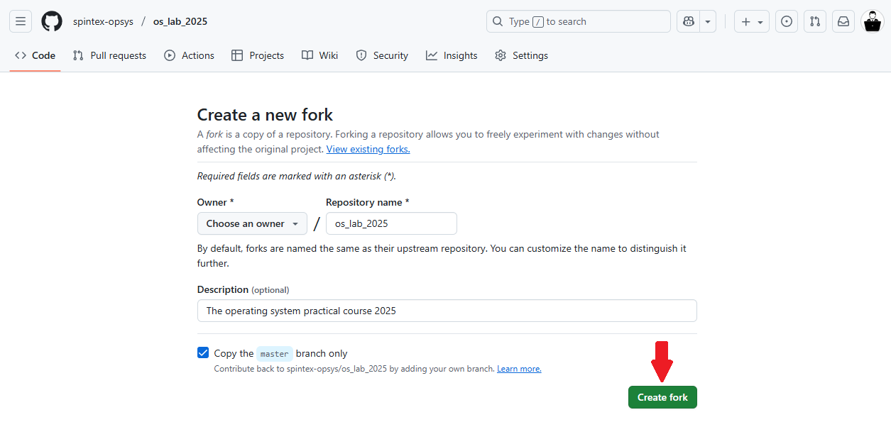
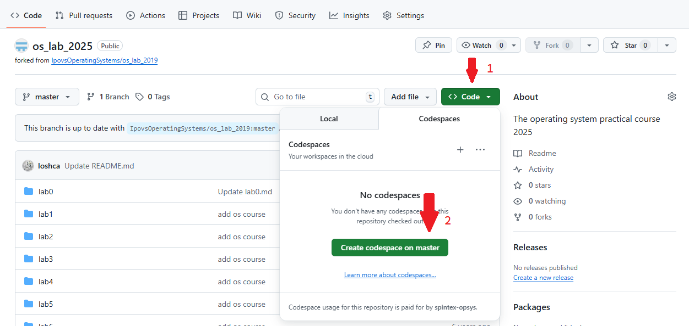
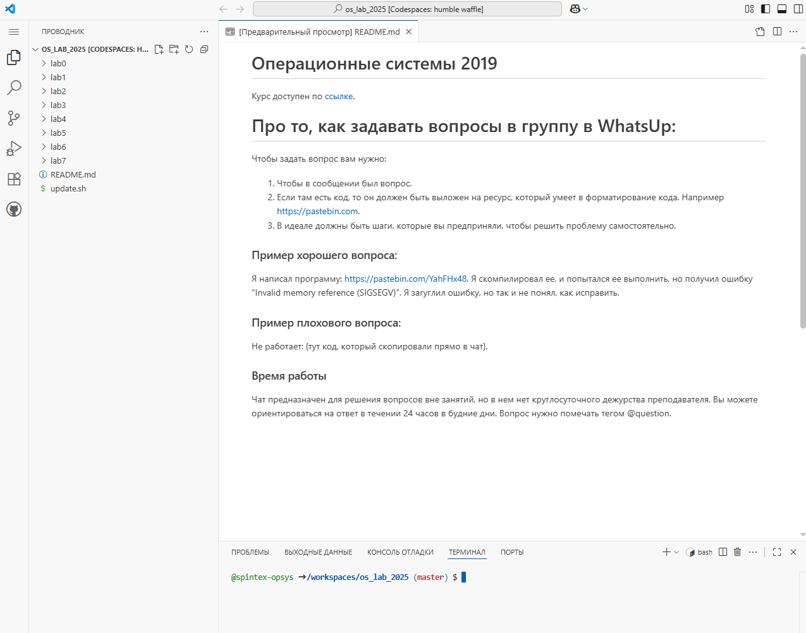
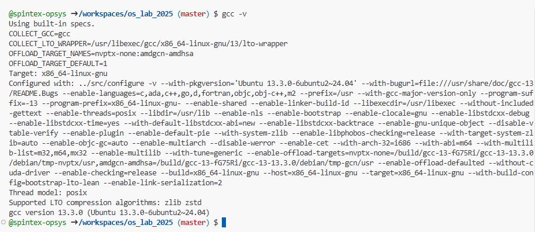

# Лабораторная работа №0

### О курсе

Это курс "Операционные системы". Нулевая лабораторная работа будет посвящена настройке и использованию инструментов, с которыми вам придется работать весь курс.

# Задание 1

## GitHub

Вам понадобится аккаунт GitHub. Поэтому, если все еще нет, то зарегистрироваться можно [здесь](https://github.com/).

### Troubleshooting

**Некоторые почтовые сервисы могут заноситься GitHub в черный список. Поэтому, если ваш основной адрес электронной почты входит в этот список (туда точно входили почтовые сервисы yandex.ru и mail.ru), то при регистрации у вас может возникнуть ошибка. Чтобы зарегистрироваться вам необходимо использовать другой почтовый сервис. Известно, что почта в домене gmail.com и edu.miet.ru точно подходит для регистрации.**

Далее вам необходимо выполнить fork репозитария с заданием [отсюда](https://github.com/spintex-opsys/os_lab_2025).

## GitHub Codespaces

Основная площадка для работы. Представляет собой рабочую среду в операционной системе Linux. Интегрирована в Github. Имеется бесплатный тариф, позволяющий получить доступ к ресурсам облачной ОС.

Не запрещено пользоваться аналогичными площадками ([replit](https://replit.com/), [codesandbox](https://codesandbox.io/))

## Создаем codespace

После форка проекта в свой аккаунт необходимо создать новый codespace. Для этого на главной странице репозитория в **своём** аккаунте необходимо нажать "Code", затем "Create codespace on master".

Перед вами откроется интерфейс VSCode Online.

## Terminal

Для открытия панели терминала необходимо нажать сочетание клавиш `Ctrl+ё`, либо найти данный пункт в меню "Терминал" (три полоски в левом верхнем углу). Если терминал открылся и вас встречает строка ввода - всё готово к работе. В противном случае в открывшейся снизу панели потребуется нажать цветную кнопку, далее вверху экрана выбрать тариф с наименьшим кол-вом предоставляемых ресурсов (ядра ЦПУ и ОЗУ). при таком подходе предоставленных облачных ресурсов должно гарантированно хватить.

Большинство заданий курса будет задействовать терминал.

## Навигация

По умолчанию _GitHub Codespaces_ открывает терминал в директории `/workspaces/os_lab_2025/`.

На этом этапе можно поговорить, как _GitHub Codespaces_ вообще работает. вы уже создали codespace, а значит _GitHub Codespaces_, где-то хранит под него данные в виде проектов. Когда вы запускаете codespace _GitHub Codespaces_ запускает для вас [Docker](https://ru.wikipedia.org/wiki/Docker) контейнер, вам не обязательно знать, как он работает, но **что важно помнить: каждый раз, когда вы завершаете работу в codespace, сохраняются только то, что вы запушили в свой репозиторий. Все, остальное может быть утерено при новом запуске**.

Немножко базовых функций для навигации по файловой системе:

- `cd [path]` - команда для смены рабочей директории
- `ls [path]` - показывает содержимое директории
- `pwd` - команда, чтобы определить, в какой директории вы находитесь сейчас
- `touch file` - команда, которая создаст для вас пустой файл.
- `mkdir dir` - команда для создания новой директории.
- `cp file1 file2` - копирует из одного файла в другой
- `mv file1 file2` - перемещает файл из одного места в другое
- `rm file` - удаление файла
- `echo` - вывод в окно терминала

# Задание 2

Вам необходимо разобраться, как работают эти команды более детально. Время познакомиться с еще одной особенностью курса - наличие заданий на поиск информации. Многие задания этого курса будут заключаться в том, чтобы найти решение самому, поэтому _google_ ваш главный помощник. Это очень сложный навык, поэтому в первый раз мы протянем вам [руку помощи](https://track24.ru/google/?q=filesystem%20navigation%20linux).

Лучший интро по версии преподавателей можно найти [тут](https://www.digitalocean.com/community/tutorials/basic-linux-navigation-and-file-management)

**В качестве задания вам необходимо с помощью терминала:**

- в проекте `lab0` создать папку `hello`
- внутри этой папки создать пустой файл `empty`
- скопировать файл `hello.c` из `lab0/src` в новую папку
- переименовать его в `newhello.c`

## update.sh

В предыдущем задании вы уже столкнулись с выполнением программ в терминале ОС Linux. Есть два способа вызвать программу в терминале:

1. Указать ее полный или относительный путь. Например утилита mv (move), которая находится в директории /bin/ может быть вызвана `/bin/mv`, но если вы уже находитесь в директории /bin/ вы можете вызвать ее по относительному пути `./mv`.
2. Добавить директорию, в которой находится программа в переменную окружения `PATH`. Тогда вы сможете вызывать программу, не указывая ее путь, например: `touch empty`. Базовые утилиты, которые вы уже использовали для создания новой папки, копирования и переименования файлов, добавлены в `PATH` по умолчанию.

В рамках курса мы будем использовать различные консольные утилиты, которые _GitHub Codespaces_ по умолчанию не устанавливает. А еще GitHub Codespaces\_ не всегда сохраняет вам окружение между запусками, а это значит, что при каждом новом запуске codespace вам возможно придется переустанавливать некоторый набор утилит. Мы постарались облегчить вам этот процесс, добавив в корень проекта скрипт `update.sh`.

# Задание 3

**Запустите update.sh, который находится в корне проекта**

Чтобы проверить, что вы все сделали верно, выполните команду: `ping ya.ru -с 5`, если вы увидели, что-то вроде этого, то вы все сделали правильно:

    PING ya.ru (87.250.250.242) 56(84) bytes of data.
    64 bytes from ya.ru (87.250.250.242): icmp_seq=1 ttl=38 time=107 ms
    64 bytes from ya.ru (87.250.250.242): icmp_seq=2 ttl=38 time=107 ms
    64 bytes from ya.ru (87.250.250.242): icmp_seq=3 ttl=38 time=107 ms
    64 bytes from ya.ru (87.250.250.242): icmp_seq=4 ttl=38 time=107 ms
    64 bytes from ya.ru (87.250.250.242): icmp_seq=5 ttl=38 time=107 ms

    --- ya.ru ping statistics ---
    5 packets transmitted, 5 received, 0% packet loss, time 4004ms
    rtt min/avg/max/mdev = 107.155/107.176/107.204/0.293 ms

> ping устанавливается в update.sh

## gcc

Ваши проекты это обычно лишь программный код, который представляет собой текстовые файлы, но ваш код компилируется не с помощью магии (даже, если в `Visual Studio` это выглядит именно так) - вам нужен компилятор. В запущенном codespace удже предустановлен компилятор gcc, а значит мы уже можем выполнить команду в терминале:

`gcc -v`

Вы должны увидеть что-то типо такого:

Если это так, то смело читайте дальше, если вы увидели сообщение "command not found", то вероятнее всего вы не выполнили `update.sh`, в котором продублирована установка компилятора.

## Задание 4

После выполнения всех заданий у вас должна быть создана папка `hello` с `newhello.c` внутри. Необходимо его скомпилировать: `gcc newhello.c -o hello_world`.

В вашей папке должен появиться исполняемый файл **hello_world**. Запустите его. вы должны увидеть сообщение "Hello, world!".

## Ваши изменения должны попадать в GitHub

Перед тем, как сдавать работу преподавателю, необходимо закоммитить ваши изменения, для этого из корня проекта необходимо выполнить:

1. `git add lab0/src/hello/empty` - добавит ваш созданный пустой файл в репо
2. `git add lab0/hello/newhello.c` - добавит ваш c-файл в репозиторий
3. Выполнить `git status` и убедиться, что вы добавили в репозиторий только файлы **empty и newhello.c**. **Файл hello_world не должен быть добавлен!**
4. Выполнить `git commit -m "добавлен hello.c и empty".`
5. Выполнить `git push`
6. Убедиться через веб интерфейс GitHub, что ваши файлы закоммичены и находятся в репозитории.
